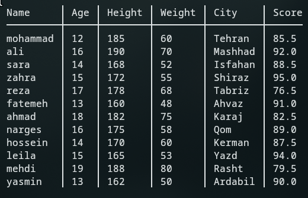

# csvue

Your data in full view: elegant CSV printing for the terminal

## Installation
To install the software, download the latest stable version from the `Release` section and place it in the `bin` folder.

## Build
```
./build.sh
```

## Build dependencies
- gcc version 13 (or another compiler, but if you don't use gcc you will need to compile manually)

## Participate
Create a branch, develop and submit a pull request.
I will review all requests. No prior coordination is required. It is better to read the tasks you want to do from the [TODO]("./TODO") list.
